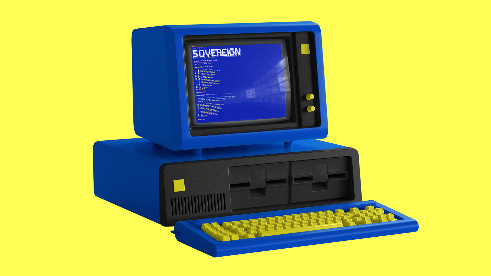
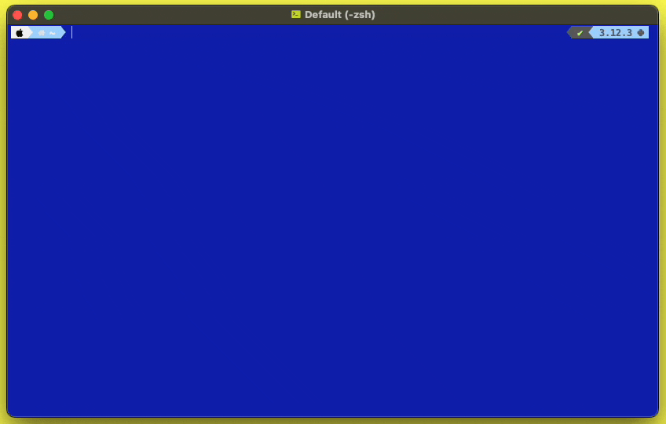
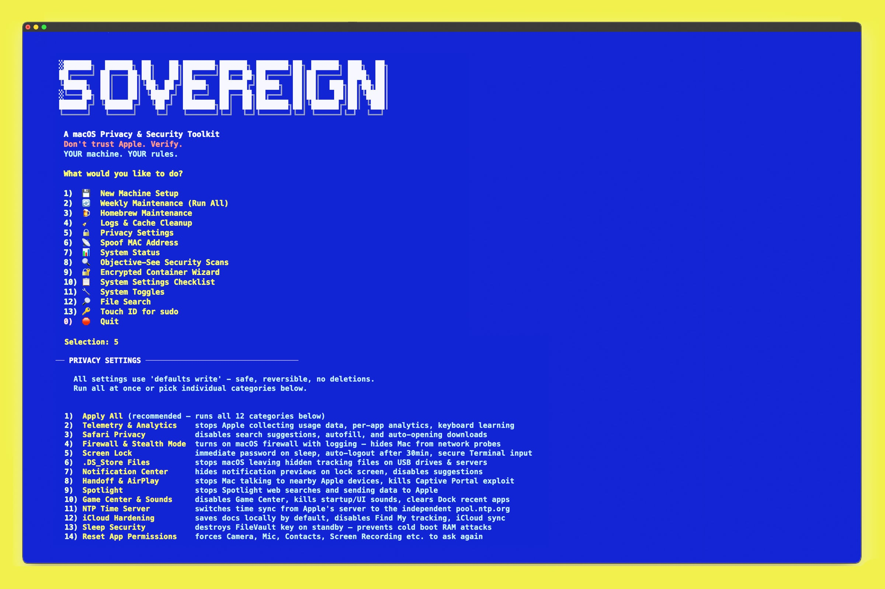

# sovereign-mac

> **A macOS Privacy & Security Toolkit**
> *Don't trust Apple. Verify. YOUR machine. YOUR rules.*

<div align="center"></div>

<div align="center"></div>

---

sovereign-mac is a menu-driven shell script that automates macOS privacy hardening, system cleanup, and security scanning. No technical expertise required. Every option tells you exactly what it does before it does it — nothing runs silently.

Built for people who want a private, hardened Mac but don't want to spend hours googling terminal commands.

> Want to see every exact terminal command the script runs, organized by module? → **[COMMANDS.md](COMMANDS.md)**

## Quick Links

- [Quick Start](#quick-start)
- [Features](#features)
- [Philosophy](#philosophy)
- [Recommended Tools](#-recommended-tools)
- [Command Reference](COMMANDS.md) ← full list of every terminal command
- [Credits](#-credits--inspiration)
- [License](#-license)

---

## Why This Exists

Apple's macOS sends a surprising amount of data about your usage to Apple's servers — crash reports, analytics, app activity, Siri queries, location data, keyboard input corrections, ad targeting profiles, and more. Most of it is on by default.

Turning it all off manually requires running dozens of individual terminal commands scattered across forum posts, blog articles, and security guides. sovereign-mac does all of it in one place, with plain-English explanations at every step.

---

## Quick Start

<div align="center"></div>

> **Don't know what Terminal is?** It's a built-in macOS app. Press `Command + Space`, type `Terminal`, and press Enter.

**Step 1** — Download `sovereign.sh` from this repo (click the file, then the download button)

**Step 2** — Open Terminal and navigate to where you downloaded it. If you saved it to your Downloads folder:
```bash
cd ~/Downloads
```

**Step 3** — Make the script executable (this is a one-time step that tells macOS "this file is allowed to run"):
```bash
chmod +x sovereign.sh
```

**Step 4** — Run it:
```bash
./sovereign.sh
```

That's it. You'll see a menu. Type a number and press Enter to select an option.

> **Tip:** The script will ask for your Mac password when it needs to make system-level changes. This is normal — it's the same password you use to install apps. Nothing is sent anywhere.

---

## Requirements

- macOS 12 Monterey or newer (fully tested on Sequoia)
- That's it for most features

**Optional (unlocks additional features):**
- [Homebrew](https://brew.sh) — macOS package manager, used by New Machine Setup and File Search
- [ripgrep](https://github.com/BurntSushi/ripgrep) — `brew install ripgrep` — unlocks content search in File Search
- [exiftool](https://exiftool.org) — `brew install exiftool` — unlocks EXIF metadata stripping in File Search
- [Objective-See tools](https://objective-see.org) — free security apps used by the Security Scans module

---

## Features

### 1 · New Machine Setup
One-time hardening tasks for a fresh macOS installation. Run these in order on a new machine, or after a factory reset.

| Step | What it does |
|------|-------------|
| Install Homebrew | Installs the most popular macOS package manager with security settings locked down |
| Harden Homebrew | Disables insecure redirects, requires checksum verification on all installs |
| Set Hostname | Randomizes your computer's network name so it doesn't broadcast your real name |
| Block Trackers | Downloads Steven Black's unified hosts file — blocks ~150,000 known tracker and ad domains at the OS level |
| Generate SSH Key | Creates a modern Ed25519 SSH key pair for secure server access |
| Harden Git | Configures Git with security best practices |
| Show Hidden Files | Reveals hidden system files in Finder |
| Secure umask | Sets file permissions so new files are owner-only by default (requires restart) |

> *"Leverage technology before it leverages you."*

<details>
<summary><strong>Show terminal commands</strong></summary>

| Command | What it does |
|---------|-------------|
| `/bin/bash -c "$(curl -fsSL https://raw.githubusercontent.com/Homebrew/install/HEAD/install.sh)"` | Installs Homebrew |
| `echo "export HOMEBREW_NO_INSECURE_REDIRECT=1" >> ~/.zprofile` | Prevents following insecure HTTP redirects |
| `echo "export HOMEBREW_CASK_OPTS=--require-sha" >> ~/.zprofile` | Requires SHA verification on all cask installs |
| `sudo scutil --set ComputerName / HostName / LocalHostName "<name>"` | Sets computer name across all three system namespaces |
| `curl -fsSL https://raw.githubusercontent.com/StevenBlack/hosts/master/hosts` | Downloads ~150k domain blocklist |
| `ssh-keygen -t ed25519 -C "<label>" -f ~/.ssh/id_ed25519` | Generates Ed25519 SSH key pair |
| `git config --global credential.helper ""` | Disables plaintext Git credential storage |
| `defaults write com.apple.finder AppleShowAllFiles TRUE` | Shows hidden files in Finder |
| `sudo launchctl config user umask 077` | Sets owner-only permissions on all new files |

See [COMMANDS.md](COMMANDS.md) for the full command list with all arguments.

</details>

---

### 2 · Weekly Maintenance
Runs Homebrew updates, all Privacy Settings, and full Logs & Cache Cleanup back-to-back with a single selection. Designed to be run weekly. Shows you exactly what it will do before starting.

---

### 3 · Homebrew Maintenance
Keeps your Homebrew installation clean and secure.

- Updates all installed packages
- Lists everything currently installed
- Uninstalls apps with `--zap` (removes all associated files, not just the app)
- Removes orphaned dependencies
- Clears download cache

<details>
<summary><strong>Show terminal commands</strong></summary>

| Command | What it does |
|---------|-------------|
| `brew analytics off` | Disables Homebrew telemetry |
| `brew update` | Fetches latest package index |
| `brew upgrade --greedy` | Upgrades all packages including GUI apps |
| `brew cleanup -s` | Removes old versions and clears download cache |
| `brew autoremove` | Removes unused dependencies |
| `brew doctor` | Diagnoses installation issues |
| `brew uninstall --cask --zap --force <app>` | Removes app and all associated files |

</details>

---

### 4 · Logs & Cache Cleanup
Wipes forensic traces and frees disk space. Typically recovers 1–10GB+.

**What gets deleted:**
- Terminal history (bash and zsh)
- Download quarantine history
- Trash on all mounted volumes
- System logs, audit logs, ASL logs, diagnostic logs
- Daily, weekly, and monthly maintenance logs
- System and user caches (including Homebrew, pip, npm, yarn)
- Quick Look thumbnail cache
- Print spooler cache
- Xcode derived data and archives
- **Safari forensic wipe** — History database (all journal files), Downloads list, Top Sites, Last Session, cookies, recent searches, webpage previews, cached icons
- Mail app connection logs
- iOS device backup records and connected device fingerprints
- App install receipts and history
- DNS cache flush
- RAM cache purge

<details>
<summary><strong>Show terminal commands</strong></summary>

| Command | What it does |
|---------|-------------|
| `sqlite3 ~/Library/Preferences/com.apple.LaunchServices.QuarantineEventsV2 'delete from LSQuarantineEvent'` | Clears download quarantine history |
| `rm -f ~/.bash_history && rm -f ~/.zsh_history` | Deletes terminal history |
| `sudo rm -rf /Volumes/*/.Trashes/*` | Empties Trash on all volumes |
| `sudo rm -rf /Library/Logs/* /var/audit/* /private/var/log/asl/*` | Deletes system, audit, and ASL logs |
| `sudo rm -rf /Library/Caches/* ~/Library/Caches/*` | Deletes system and user caches |
| `qlmanage -r cache` | Clears Quick Look thumbnail cache |
| `sudo rm -rf /var/spool/cups/c0*` | Clears print spooler |
| `rm -f ~/Library/Safari/History.db ~/Library/Cookies/Cookies.binarycookies` | Safari forensic wipe (16 files total) |
| `sudo rm -rf /var/db/lockdown/*` | Deletes connected device fingerprints |
| `sudo dscacheutil -flushcache && sudo killall -HUP mDNSResponder` | Flushes DNS cache |
| `sudo purge` | Purges RAM cache |

See [COMMANDS.md](COMMANDS.md) for the complete list of all ~45 cleanup commands.

</details>

---

### 5 · Privacy Settings
The core of the toolkit. Twelve granular categories of `defaults write` commands — all safe, all reversible, none require deletions. Run all at once or pick individual categories.

<div align="center"></div>

| Category | What it does |
|----------|-------------|
| **Telemetry & Analytics** | Stops Apple collecting usage data, crash reports, per-app analytics (WiFi, Wallet, Maps, News, Photos), keyboard learning, internet spell correction, ad tracking |
| **Safari Privacy** | Disables search suggestions, autofill (addresses, passwords, credit cards, forms), auto-opening of downloaded files |
| **Firewall & Stealth Mode** | Enables macOS firewall with logging, stealth mode (your Mac won't respond to network probes), disables auto-allow for signed apps |
| **Screen Lock** | Requires password the instant your screen sleeps, disables FDE auto-login, sets 30-minute auto-logout, enables secure keyboard entry in Terminal |
| **.DS_Store Files** | Stops macOS leaving hidden metadata files on USB drives and network servers |
| **Notification Center** | Hides notification content on lock screen, disables notification suggestions |
| **Handoff & AirPlay** | Stops your Mac talking to nearby Apple devices, kills Captive Portal (a known WiFi attack vector), disables Remote Apple Events, disables network wake |
| **Spotlight** | Stops Spotlight sending your searches to Apple, disables Siri suggestions and web results |
| **Game Center & Sounds** | Disables Game Center entirely, kills startup sound and UI sounds, removes recent apps from Dock, shows all file extensions (prevents `.jpg.app` disguises) |
| **NTP Time Server** | Switches time sync from Apple's server to the independent pool.ntp.org |
| **iCloud Hardening** | Changes document save default from iCloud to local disk, disables Desktop/Documents folder sync, disables Find My tracking |
| **Sleep Security** | Destroys your FileVault encryption key when the Mac enters standby — prevents cold boot RAM extraction attacks. Enables immediate standby regardless of battery level. |

**Reset App Permissions** — a separate submenu with 10 individual options and one "Extended" batch covering 22 total TCC service categories. Forces every app to ask for permission again for Camera, Microphone, Screen Recording, Full Disk Access, Contacts, Calendar, Accessibility, Location, Photos, Speech Recognition, and more.

<details>
<summary><strong>Show terminal commands</strong></summary>

Privacy settings use `defaults write` — the standard macOS preference system. Every change is reversible. See [COMMANDS.md](COMMANDS.md) for the complete list of all ~60 commands across all 12 categories. A few representative examples:

| Command | What it does |
|---------|-------------|
| `defaults write com.apple.AdLib forceLimitAdTracking -bool true` | Forces ad tracking limit |
| `sudo /usr/libexec/ApplicationFirewall/socketfilterfw --setstealthmode on` | Enables stealth mode — Mac ignores unsolicited network probes |
| `sudo pmset -a destroyfvkeyonstandby 1` | Destroys FileVault key on standby — prevents cold boot attacks |
| `sudo defaults write /Library/Preferences/SystemConfiguration/com.apple.captive.control.plist Active -bool false` | Disables Captive Portal (WiFi attack vector) |
| `defaults write com.apple.screensaver askForPasswordDelay -int 0` | Password required immediately on sleep |
| `tccutil reset Camera` | Forces all apps to re-request Camera access |
| `defaults write NSGlobalDomain AppleShowAllExtensions -bool true` | Shows all file extensions — prevents `.jpg.app` masquerades |

</details>

---

### 6 · Spoof MAC Address
Changes your Wi-Fi adapter's hardware address — useful for privacy on public networks. Your real MAC address is restored on reboot (Apple Silicon limitation).

- Randomize Wi-Fi MAC address
- Randomize a specific network interface
- Restore your original hardware MAC address
- Show all current MAC addresses

<details>
<summary><strong>Show terminal commands</strong></summary>

| Command | What it does |
|---------|-------------|
| `networksetup -setairportpower <iface> off` | Disables Wi-Fi (required before MAC change) |
| `sudo ifconfig <iface> ether <mac>` | Sets new MAC address |
| `networksetup -setairportpower <iface> on` | Re-enables Wi-Fi |
| `networksetup -listallhardwareports` | Lists all interfaces and current MACs |

</details>

---

### 7 · System Status
Read-only security audit. Nothing changes — it just checks and reports.

- Spotlight indexing status
- FileVault encryption status
- System Integrity Protection (SIP) status
- Gatekeeper status
- Available OS updates
- LaunchAgents (opens in Finder for easy review and deletion)

<details>
<summary><strong>Show terminal commands</strong></summary>

| Command | What it does |
|---------|-------------|
| `mdutil -s /` | Reports Spotlight indexing status |
| `fdesetup status` | Reports FileVault status |
| `csrutil status` | Reports SIP status |
| `spctl --status` | Reports Gatekeeper status |
| `softwareupdate -l` | Lists available OS updates |

</details>

---

### 8 · Objective-See Security Scans
Checks the status of Patrick Wardle's free security tools and runs them if installed.

| Tool | What it does |
|------|-------------|
| **LuLu** | Open-source outbound firewall — alerts when apps try to phone home |
| **KnockKnock** | Scans for persistent malware and checks against VirusTotal |
| **TaskExplorer** | Shows all running processes with VirusTotal reputation scores |
| **BlockBlock** | Monitors for persistence attempts in real time |
| **RansomWhere** | Detects ransomware-like file encryption activity |
| **ReiKey** | Detects keyloggers by monitoring for keyboard event taps |

If a tool isn't installed, the script offers to open the download page.

---

### 9 · Encrypted Container Wizard
Creates and manages AES-256 encrypted disk images using macOS's built-in `hdiutil`. No third-party software required.

- Create a new encrypted container (specify name, size, and location)
- Mount an existing container (prompts for password)
- Unmount an open container
- List all currently mounted containers

<details>
<summary><strong>Show terminal commands</strong></summary>

| Command | What it does |
|---------|-------------|
| `hdiutil create -size <size>m -fs APFS -encryption AES-256 -volname <name> -type UDIF <output.dmg>` | Creates AES-256 encrypted disk image |
| `hdiutil attach <path.dmg> -notremovable` | Mounts container (prompts for password) |
| `hdiutil detach /Volumes/<name>` | Unmounts (ejects) a container |
| `hdiutil info` | Lists all mounted disk images |

</details>

> *"That's the incomparable beauty of the cryptological art. A little bit of math can accomplish what all the guns and barbed wire can't. A little bit of math can keep a secret."*
> — Edward Snowden

---

### 10 · System Settings Checklist
A guided walkthrough of privacy settings that can only be changed through macOS System Settings (not via terminal commands). The script opens the correct System Settings pane automatically — you just follow the checklist.

Covers: Wi-Fi, General, Siri & Spotlight, Notifications, Lock Screen, Privacy & Security (including Lockdown Mode), iCloud, Game Center, Wallet & Apple Pay, and Auto-Updates.

---

### 11 · System Toggles
One-click switches for common hardening tasks. Each one confirms before running.

| Toggle | What it does |
|--------|-------------|
| Enable / Disable Spotlight | Turns Spotlight indexing on or off completely |
| Enable / Disable Gatekeeper | Controls whether macOS verifies app signatures |
| Disable Siri | Full launchctl disable — kills all Siri background services |
| Disable AirDrop | Turns off AirDrop |
| Disable Remote Connections | Kills SSH, TFTP, Telnet, mDNS multicast, printer sharing, and wipes all Apple Remote Desktop data |
| Disable Time Machine | Turns off automatic backups |
| Disable Guest Account | Full lockdown via both `defaults write` and `sysadminctl` — covers login screen, SMB, and AFP access |
| Login Window Name & Password | Switches the login screen from showing user icons to a name + password prompt (stops attackers from knowing which accounts exist) |

<details>
<summary><strong>Show terminal commands</strong></summary>

| Command | What it does |
|---------|-------------|
| `sudo mdutil -i off / && sudo mdutil -E /` | Disables Spotlight indexing |
| `sudo spctl --master-disable` | Disables Gatekeeper |
| `sudo launchctl disable 'system/com.apple.assistantd'` | Disables Siri (one of 6 launchctl calls) |
| `defaults write com.apple.NetworkBrowser DisableAirDrop -bool true` | Disables AirDrop |
| `sudo systemsetup -setremotelogin off` | Disables SSH |
| `sudo launchctl disable 'system/com.apple.tftpd'` | Disables TFTP |
| `sudo launchctl disable system/com.apple.telnetd` | Disables Telnet |
| `sudo defaults write /Library/Preferences/com.apple.mDNSResponder.plist NoMulticastAdvertisements -bool true` | Disables mDNS multicast |
| `cupsctl --no-share-printers --no-remote-any --no-remote-admin` | Disables all printer sharing |
| `sudo rm -rf /var/db/RemoteManagement` | Wipes Apple Remote Desktop data |
| `sudo tmutil disable` | Disables Time Machine |
| `sudo sysadminctl -guestAccount off` | Disables Guest account (one of 3 sysadminctl calls) |
| `sudo defaults write /Library/Preferences/com.apple.loginwindow SHOWFULLNAME -bool true` | Sets name+password login screen |

</details>

---

### 12 · File Search
Search your filesystem and strip metadata from images. Drag a folder into the terminal to set the search location — no typing required.

| Option | What it does |
|--------|-------------|
| Search by Filename | Finds files by name anywhere in your home folder (or any folder you drag in). Searches 5 levels deep, capped at 100 results. |
| Search by Content | Full-text search inside files using ripgrep. Skips binary files. Default: ~/Documents. |
| Search by Size | Finds files above a size threshold. Preset options (100MB–5GB) or custom. Shows top 50 largest. |
| **Strip EXIF Metadata** | Removes all metadata from an image — GPS location, camera model, serial number, timestamps. Prevents doxxing via photo sharing. Requires exiftool (script offers to install it). |

---

## Philosophy

sovereign-mac follows a strict set of principles:

**Full disclosure before every action.** Every option shows exactly what it will do before asking you to confirm. Nothing runs silently.

**Safe and reversible.** Privacy Settings use `defaults write` — the standard macOS preference system. Every change can be undone. Nothing deletes system files.

**Minimum footprint.** No installation. No background processes. No configuration files. One script. Run it, close Terminal.

**Plain English.** Every menu option has a plain-English description. No assumption of technical knowledge.

---

## About the Name

**VONU** — *VOluntary Not vUlnerable*

> *"Vonu is the condition or quality of, as well as the action of achieving, an invulnerability to coercion — emphasizing individual responsibility, empowerment, and ultimately FREEDOM."*
> — [Rayo](https://ad-store.sgp1.digitaloceanspaces.com/VONU/2022/08/Vonu%20Book%201%20Paperback%20Official.pdf), libertarian theorist (1960s)

The name originates from Rayo's philosophy of personal sovereignty through radical self-liberation. In the context of macOS privacy, vonu means exactly what it says: your machine should be voluntary and not vulnerable — working for you, on your terms, under your control. Not Apple's.

---

## Security Note

Always review scripts before running them. `sovereign.sh` is plain zsh — no obfuscation, no minification, no funny business. Read it.

Verify the file integrity before running:
```bash
shasum -a 256 sovereign.sh
```

**Expected SHA256:**
```
a24a61eb638d6fc9bd55a6c517c0c5f0bd3dae630fbfbcb82b410bc772a49057
```

---

## 🔧 Recommended Tools

These aren't required to run sovereign-mac but represent the broader privacy stack worth building around it.

### Browsers
- **[Firefox](https://www.mozilla.org/firefox/)** — open source, extensible, the daily driver. Pair with uBlock Origin.
- **[LibreWolf](https://librewolf.net/)** — Firefox fork with hardened defaults out of the box
- **[Mullvad Browser](https://mullvad.net/browser)** — built with Tor Project, designed to minimize fingerprinting without requiring Tor network
- **[Tor Browser](https://www.torproject.org/)** — maximum anonymity, significant tradeoffs in speed and usability. Not for daily driving.

### VPN
- **[Mullvad VPN](https://mullvad.net)** — no account required, accepts cash and crypto, no logs. The gold standard.
- **[ProtonVPN](https://protonvpn.com)** — open source, audited, strong track record

### Firewall & Security (macOS)
- **[LuLu](https://objective-see.org/products/lulu.html)** — free outbound firewall, alerts when apps phone home
- **[KnockKnock](https://objective-see.org/products/knockknock.html)** — scans for persistent malware, checks VirusTotal
- **[TaskExplorer](https://objective-see.org/products/taskexplorer.html)** — shows all running processes with reputation scores
- **[BlockBlock](https://objective-see.org/products/blockblock.html)** — monitors for persistence attempts in real time
- **[RansomWhere](https://objective-see.org/products/ransomwhere.html)** — detects ransomware-like file encryption
- **[ReiKey](https://objective-see.org/products/reikey.html)** — detects keyloggers
- **[Oversight](https://objective-see.org/products/oversight.html)** — alerts when mic or camera is activated
- **[ClamAV](https://www.clamav.net/)** — open source antivirus, CLI-based, pairs well with this script
- **[Little Snitch](https://www.obdev.at/products/littlesnitch)** — paid, more advanced outbound firewall than LuLu

### Email & Messaging
- **[ProtonMail](https://proton.me)** — encrypted email, zero-knowledge
- **[Signal](https://signal.org)** — the standard for encrypted messaging
- **[Session](https://getsession.org)** — Signal alternative, no phone number required

### Password Management
- **[KeePassXC](https://keepassxc.org)** — local, open source, no cloud sync required
- **[Bitwarden](https://bitwarden.com)** — open source, self-hostable cloud option

### Terminal Setup
- **[iTerm2](https://iterm2.com)** — the macOS terminal replacement. What the screenshots in this README were made with.
- **[Powerlevel10k](https://github.com/romkatv/powerlevel10k)** — zsh theme, instant prompt, beautiful and fast
- **[iTerm2 Color Schemes](https://iterm2colorschemes.com)** — 250+ curated color themes

### Further Reading
- **[privacytools.io](https://www.privacytools.io)** — comprehensive privacy tool recommendations, actively maintained
- **[Privacy Guides](https://www.privacyguides.org)** — community-driven privacy recommendations
- **[Surveillance Self-Defense (EFF)](https://ssd.eff.org)** — practical guides from the Electronic Frontier Foundation

---

Looking for more? I maintain an ever-evolving list of 1,000+ hand-picked privacy tools, books, software, and resources at **[chrisvrakas.com/resources.html](https://chrisvrakas.com/resources.html)** — also available as an open-source repo at **[github.com/chrisvrakas/awesome-polymathic-resource-stack](https://github.com/chrisvrakas/awesome-polymathic-resource-stack)**.

---

## 🙏 Credits & Inspiration

sovereign-mac stands on the shoulders of people who have spent years documenting macOS privacy and security. If you find this tool useful, check out their work:

- **[Michael Bazzell / IntelTechniques](https://inteltechniques.com)** — macOS privacy guide and terminal scripts from *Extreme Privacy* — the book that started this
- **[Patrick Wardle / Objective-See](https://objective-see.org)** — LuLu, KnockKnock, TaskExplorer, BlockBlock, RansomWhere, ReiKey — essential free security tools for macOS
- **[drduh / macOS-Security-and-Privacy-Guide](https://github.com/drduh/macOS-Security-and-Privacy-Guide)** — the definitive macOS security reference on GitHub
- **[undergroundwires / privacy.sexy](https://github.com/undergroundwires/privacy.sexy)** — comprehensive macOS/Windows/Linux privacy script collection
- **[herrbischoff / awesome-macos-command-line](https://github.com/herrbischoff/awesome-macos-command-line)** — curated macOS CLI reference
- **[StevenBlack / hosts](https://github.com/StevenBlack/hosts)** — unified hosts file blocking ~150,000 tracker and ad domains
- **[arkenfox / user.js](https://github.com/arkenfox/user.js)** — Firefox hardening reference
- **[Sun Knudsen](https://sunknudsen.com)** — macOS privacy guides including cold boot attack protection
- **[Rayo](https://ad-store.sgp1.digitaloceanspaces.com/VONU/2022/08/Vonu%20Book%201%20Paperback%20Official.pdf)** — the Vonu philosophy: *VOluntary Not vUlnerable*

---

## 📄 License

**When everyone copyrights, copyleft.**

This project is open source and available under the [MIT License](LICENSE) — fork it, modify it, learn from it. Just give credit where it's due.

---

## 📬 Contact

**Chris Vrakas**

- Website: [chrisvrakas.com](https://chrisvrakas.com)
- GitHub: [@chrisvrakas](https://github.com/chrisvrakas)
- X: [@chris_vrakas](https://x.com/chris_vrakas)
- Medium: [@chrisvrakas](https://medium.com/@chrisvrakas)
- PGP: [connect@chrisvrakas.com](mailto:connect@chrisvrakas.com)

---

## ⚡ Fast Facts

- **Zero installation** — no npm, no webpack, no build step, no dependencies
- **Zero tracking** — no analytics, no telemetry, no phoning home
- **Zero trust** — in Apple's defaults, in surveillance capitalism, in the idea that privacy is something to opt into
- **100% zsh** — readable, auditable, yours
- **Shows its work** — every option tells you exactly what it's about to do before doing it. No silent execution, no surprises. Most competing scripts just run.
- **Opens System Settings for you** — the checklist module doesn't just list settings to find yourself. It opens the exact System Settings pane automatically. Nobody else does this.

---

<div align="center">

*"Privacy is not the antithesis of security. Privacy is security, and security is not the absence of crime, it is the presence of justice."*

**— Andreas Antonopoulos**

<br>

**[chrisvrakas.com](https://chrisvrakas.com)** · **[@chris_vrakas](https://x.com/chris_vrakas)** · **[GitHub](https://github.com/chrisvrakas)**

<br>

*YOUR machine. YOUR rules.*

</div>
